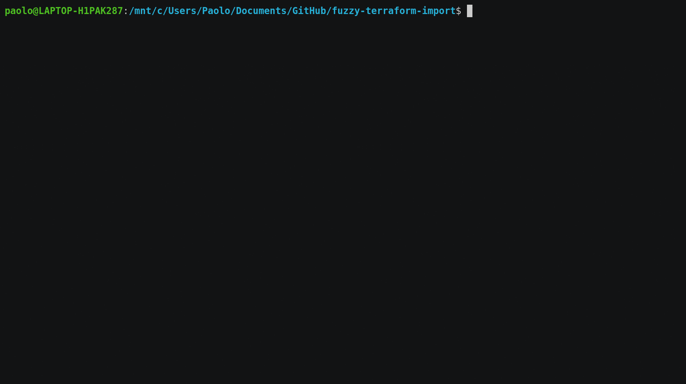

# fuzzy-terraform-import

fuzzy-terraform-import is a command-line tool for importing resources into terraform state



It uses the excellent [go-fuzzyfinder](https://github.com/ktr0731/go-fuzzyfinder) library for the fuzzy-finding functionality.

## Installation

```bash
$ go install github.com/paololazzari/fuzzy-terraform-import@latest
```

## Usage

```bash
$ fuzzy-terraform-import
```

## How it works

fuzzy-terraform-import looks at the terraform source (.tf) files and at the terraform state to determine which resources can be imported.

## Supported resources

This project is under development. For a list of supported resources, check the [supported resources](doc/supported-resources.md).
